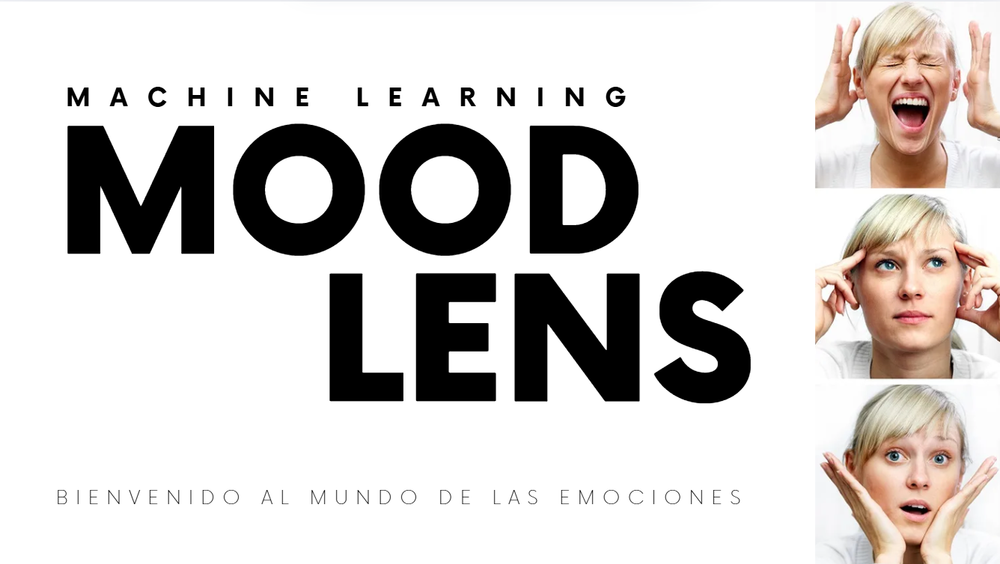

# Descubre MoodLens: Tu Aliado en el Reconocimiento de Emociones

## ¿Qué es MoodLens?  
MoodLens es una aplicación innovadora diseñada para transformar la forma en que las personas con trastorno del espectro autista (TEA) perciben y comprenden las emociones.  

A través de la libreria TensorFlow y una red neuronal convolucional (CNN) entrenada para el reconocimiento facial, MoodLens captura expresiones en tiempo real a través de la cámara de tu dispositivo y las convierte en pictogramas claros y universales.  

Estos pictogramas facilitan la identificación de emociones básicas como **alegría, tristeza, enfado, sorpresa o miedo**, ofreciendo una herramienta inclusiva para mejorar la comunicación y la interacción social.  

## ¿Cómo funciona?  

1. **Detección en tiempo real**: Al abrir la app, MoodLens activa la cámara y analiza los rostros detectados.  
2. **Procesamiento con IA**: El modelo, entrenado con miles de imágenes de expresiones faciales, clasifica la emoción expresada con precisión.  
3. **Traducción visual**: La emoción identificada se convierte instantáneamente en un pictograma intuitivo (diseñado con colores y formas amigables), acompañado de una descripción textual breve.   

## Indice del repositorio
📂 Presentaciones (Todas las presentaciones del proyecto)  
📂 aproximaciones (Todos los diferentes modelos y tecnologias de pruebas)  
│── 📁 CNN (Primer Modelo para lectura de imagenes jpeg)      
│── 📁 RandomForestClassifier (Primer Modelo basico y perfectamente funcional)   
│── 📁 Yolo (Primer acercamiento a la tecnologia de Ultralitycs)    
📂 img (Imagenes del proyecto)  
📂 modelo_final  
│── 📁 data ([Dataset Kaggle](https://www.kaggle.com/datasets/jonathanoheix/face-expression-recognition-dataset))  
│ │── 📁 images  
│ │── 📁 train  
│ │── 📁 validation  
│── 📁 emociones (Imágenes de los pictogramas usados para la comunicación TEA)  
│── 📁 face_detector (Modelo usado de detección de rostros)  
│── 📁 logs (Logs del entrenamiento)  
│── 📁 modelos entrenados (Diferentes modelos entrenados)  
│ │── 📁 one  
│ │── 📁 two  
│ │── 📁 three  
│ │── 📁 four  
│── 📁 streamlitbackup (Version simple pero solida de la app)  
│── 📄 app (Ejecutable para Streamlit)  
│── 📄 main (Ejecutable para terminal)  
│── 📄 modelFEC.h5 (Modelo en formato h5)  
│── 📄 mmodelFECH52.keras (Modelo en formato keras)  
│── 📄 notebook_entrenamiento (Notebook de entrenamiento del modelo)  
│── 📄 notebook_modelo_final (Notebook armado para el uso del modelo final)  
📂 models (Todos los modelos desarrolados durante la investigación)  
📂 notebook (Memorias sobre los diferentes modelos y como los he trabajado)      
📂 streamlit (app de streamlit)      
│ 
📄 README.md  

### Ejecución de la Aplicación
Para iniciar la aplicación, ejecuta el siguiente comando en la terminal dentro de la carpeta streamlit del repositorio:
```bash
pip install requirements.txt
streamlit run app.py
```

## Requisitos

Para ejecutar el modelo final, necesitas instalar las siguientes librerías de Python:

- pandas
- numpy
- matplotlib
- seaborn
- jupyter
- scikit-learn
- tensorflow
- keras
- streamlit
- opencv
- cv2

## Gracias

MIT License

Copyright (c) 2025 Borja Barber

Permission is hereby granted, free of charge, to any person obtaining a copy
of this software and associated documentation files (the "Software"), to deal
in the Software without restriction, including without limitation the rights
to use, copy, modify, merge, publish, distribute, sublicense, and/or sell
copies of the Software, and to permit persons to whom the Software is
furnished to do so, subject to the following conditions:

The above copyright notice and this permission notice shall be included in all
copies or substantial portions of the Software.

THE SOFTWARE IS PROVIDED "AS IS", WITHOUT WARRANTY OF ANY KIND, EXPRESS OR
IMPLIED, INCLUDING BUT NOT LIMITED TO THE WARRANTIES OF MERCHANTABILITY,
FITNESS FOR A PARTICULAR PURPOSE AND NONINFRINGEMENT. IN NO EVENT SHALL THE
AUTHORS OR COPYRIGHT HOLDERS BE LIABLE FOR ANY CLAIM, DAMAGES OR OTHER
LIABILITY, WHETHER IN AN ACTION OF CONTRACT, TORT OR OTHERWISE, ARISING FROM,
OUT OF OR IN CONNECTION WITH THE SOFTWARE OR THE USE OR OTHER DEALINGS IN THE
SOFTWARE.


