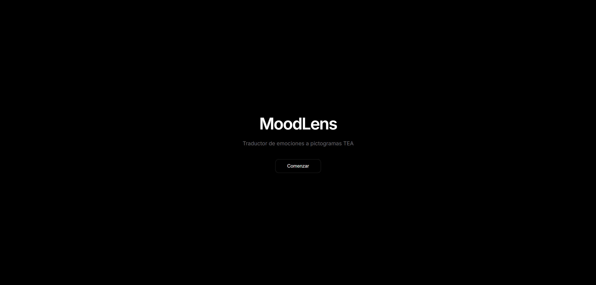

# MoodLens

**Traductor de emociones a pictogramas TEA en tiempo real**

Las emociones son un lenguaje universal que conecta a las personas. Sin embargo, para muchas personas con Trastorno del Espectro Autista (TEA), interpretar las emociones en el rostro de los demás puede resultar un gran desafío. MoodLens nace precisamente para ayudar a salvar esa distancia.

Mediante una red neuronal, MoodLens analiza en tiempo real las expresiones faciales captadas por la webcam y las traduce de forma inmediata en pictogramas visuales adaptados al lenguaje utilizado en el TEA. Más que una aplicación de reconocimiento facial, es una herramienta pensada para facilitar la comprensión del mundo emocional que nos rodea.

Con MoodLens, una sonrisa se transforma en el pictograma de felicidad. Un ceño fruncido puede convertirse en enfado o tristeza. Un gesto sencillo, representado de forma clara, que puede marcar una gran diferencia para quien necesita una guía visual para interpretar las emociones.


---

## ¿Cómo funciona?

- **Detección en tiempo real:** Al abrir la app, MoodLens activa la cámara y analiza los rostros detectados.
- **Procesamiento con IA:** La red neuronal entrenada con miles de imágenes de expresiones faciales clasifica la emoción expresada con precisión.
- **Traducción visual:** La emoción identificada se convierte instantáneamente en un pictograma TEA, acompañado de una descripción textual breve.

---

## Demo (Coming Soon)

<!-- Enlace a video de Vimeo -->
[Ver demo en Vimeo](https://vimeo.com/TU_VIDEO_ID)

---

## Características

- **CNN propia** - Red neuronal convolucional entrenada con dataset FER2013
- **Detección en tiempo real** - Procesamiento de webcam con GPU
- **7 emociones** - Enojo, asco, miedo, felicidad, neutral, tristeza, sorpresa
- **Pictogramas TEA** - Comunicación visual accesible
- **App web moderna** - React + FastAPI con diseño oscuro
- **GPU accelerated** - Soporte CUDA para inferencia rápida

---


## Arquitectura

```
moodlens/
├── models/                    # Primera versión de MoodLens
├── data/FER2013/              # Dataset (28,709 train + 7,178 test)
├── models/
│   ├── emotion_cnn.pth        # Modelo entrenado (69.7% accuracy)
│   ├── training_history.png   # Gráficas de entrenamiento
│   └── confusion_matrix.png   # Matriz de confusión
├── pictograms/                # Pictogramas TEA (7 emociones)
├── notebooks/
│   └── 01_emotion_cnn_training.ipynb
├── app/
│   ├── backend/
│   │   └── main.py            # FastAPI + WebSocket
│   ├── frontend/
│   │   └── src/App.jsx        # React + Vite
│   └── start.bat              # Script de inicio
├── webcam_emotion.py          # App standalone OpenCV
├── webcam_emotion_v2.py       # Versión simplificada
├── train_model.py             # Script de entrenamiento
└── requirements.txt           # Dependencias Python
```

---

## Instalación

### Requisitos
- Python 3.11+
- Node.js 18+
- GPU con CUDA (recomendado)

### 1. Clonar y crear entorno virtual
```bash
git clone https://github.com/TU_USUARIO/moodlens.git
cd moodlens
python -m venv .venv

# Activar entorno virtual
.venv\Scripts\activate        # Windows (cmd / PowerShell)
source .venv/bin/activate      # macOS / Linux
```

### 2. Instalar dependencias Python
```bash
# PyTorch con soporte CUDA (GPU) — elige la URL según tu versión de CUDA
pip install torch torchvision --index-url https://download.pytorch.org/whl/cu121

# Resto de dependencias del proyecto
pip install -r requirements.txt

# Dependencias del backend (FastAPI, WebSocket, OpenCV…)
pip install -r app/backend/requirements.txt
```

### 3. Instalar dependencias Frontend
```bash
cd app/frontend
npm install
```

---

## Uso

### Opción 1: App Web (Recomendada)

**Terminal 1 - Backend:**
```bash
cd moodlens
# Activar entorno virtual (si no está activo)
.venv\Scripts\activate        # Windows
source .venv/bin/activate      # macOS / Linux

python app/backend/main.py
```

**Terminal 2 - Frontend:**
```bash
cd moodlens/app/frontend
npm run dev
```

Abrir: **http://localhost:5173**

### Opción 2: App Standalone (OpenCV)
```bash
cd moodlens
# Activar entorno virtual (si no está activo)
.venv\Scripts\activate        # Windows
source .venv/bin/activate      # macOS / Linux

python webcam_emotion_v2.py
```

Controles: `Q` = Salir | `S` = Screenshot

---

## Modelo CNN

### Arquitectura
- 4 bloques convolucionales (64 → 128 → 256 → 512 filtros)
- BatchNorm + ReLU + Dropout (0.25)
- 2 capas fully connected (512 → 256 → 7)
- ~6 millones de parámetros

### Rendimiento
| Métrica | Valor |
|---------|-------|
| Accuracy | 69.7% |
| Dataset | FER2013 |
| Épocas | ~40 (Early Stopping) |


### Precisión por emoción
| Emoción | Precision |
|---------|-----------|
| Felicidad | 89% |
| Sorpresa | 80% |
| Asco | 66% |
| Enojo | 64% |
| Neutral | 61% |
| Tristeza | 56% |
| Miedo | 55% |

---

## Stack Tecnológico

| Componente | Tecnología |
|------------|------------|
| ML Framework | PyTorch 2.0 |
| Backend | FastAPI |
| Frontend | React + Vite |
| Streaming | WebSocket |
| Visión | OpenCV |
| GPU | CUDA 12.1 |

---

## Reentrenar modelo

```bash
cd moodlens
# Activar entorno virtual
.venv\Scripts\activate        # Windows
source .venv/bin/activate      # macOS / Linux

python train_model.py
```

El script:
1. Carga dataset FER2013 de `data/FER2013/`
2. Aplica data augmentation
3. Entrena con Early Stopping (patience=7)
4. Guarda modelo en `models/emotion_cnn.pth`

---

## Screenshots



| | | |
|---|---|---|
|  |  |  |
|  |  |  |
|  |  |  |
|  |  | |

---

## Licencia

MIT. Pictogramas sujetos a sus respectivas licencias.

---

## Autor

Desarrollado por Borja Barber.
